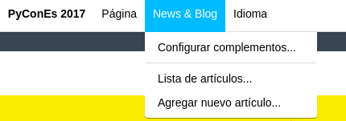
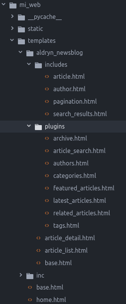

# Apphooks: Integración de aplicaciones Django en Django-CMS

La integración de otras aplicaciones en django CMS, que es de donde proviene una gran parte de su poder.

Integrar aplicaciones no sólo significa instalarlas junto a django CMS, para que coexistan pacíficamente. Significa utilizar las características de django CMS para construir un único proyecto web coherente que acelere el trabajo de gestión del sitio y haga posible una publicación más automatizada y enriquecida.

Es clave para que la integración de django CMS funcione, no requiere que modifiquemos otras aplicaciones a menos que lo deseemos. Esto es particularmente importante cuando estamos utilizando aplicaciones de terceros y no queremos tener que mantener nuestras propios forks. (La única excepción a esto es si decidimos construir características de django CMS directamente en las propias aplicaciones, por ejemplo cuando se utiliza marcadores de posición en otras aplicaciones).

Veamos el [ejemplo](http://docs.django-cms.org/en/release-3.4.x/introduction/integrating_applications.html
). de la documentación oficial de django CMS:


# Integración de third-party application

Ya sabemos crear nuestros propios plugins y aplicaciones CMS django, pero otro punto importante es extender nuestro CMS con una aplicación de terceros. Para ello vamos a integrar la aplicación **Aldryn News & Blog**.

* Instalamos la dependencia con pip

`pip install aldryn-newsblog`

* Añadimos a `INSTALLED_APPS` en el fichero `settings.py` debería quedar algo así:

```
INSTALLED_APPS = (
    'djangocms_admin_style',
    'django.contrib.auth',
    'django.contrib.contenttypes',
    'django.contrib.sessions',
    'django.contrib.admin',
    'django.contrib.sites',
    'django.contrib.sitemaps',
    'django.contrib.staticfiles',
    'django.contrib.messages',
    'cms',
    'menus',
    'sekizai',
    'treebeard',
    'djangocms_text_ckeditor',
    'filer',
    'easy_thumbnails',
    'djangocms_column',
    'djangocms_link',
    'cmsplugin_filer_file',
    'cmsplugin_filer_folder',
    'cmsplugin_filer_image',
    'cmsplugin_filer_utils',
    'djangocms_style',
    'djangocms_snippet',
    'djangocms_googlemap',
    'djangocms_video',
    'mi_web',
    'my_web_cms',
    'aldryn_apphooks_config',
    'aldryn_categories',
    'aldryn_common',
    'aldryn_newsblog',
    'aldryn_people',
    'aldryn_reversion',
    'aldryn_translation_tools',
    'parler',
    'sortedm2m',
    'taggit',
    'reversion',
    'aldryn_boilerplates',
)
```

* Ahora hacemos la migración en base de datos:

`python manage.py migrate`

* El siguiente punto es crear una página con el hook a la aplicación:
    - Crear una página CMS django y la llamamos "Blog".
    - En Configuración avanzada... > Configuración de aplicaciones, seleccione NewsBlog.

Como podemos ver en la imagen inferior ahora en la página de blog tenemos un nuevo punto de menú en el toolbar.



Añadimos un par de artículos y podemos comprobar que ya está totalmente integrada nuestro blog pero... ¡Qué feo se ve!. Vamos a adaptar las plantillas con las del tema SOLID:

* Lo primero es descargarnos el directorio `aldryn_newsblog` que está dentro del directorio templates de la aplicación. Podemos hacerlo con un `cp` desde el entorno virtual o descargando del repositorio la app.

* Ahora ponemos ese directorio dentro del directorio templates de nuestro proyecto, deberíamos tener algo así:



Ahora vamos a sobreescribir las templates que necesitamos:

* **base.html**

```




  <div class="container mtb">
       <div class="row">
         <! -- BLOG POSTS LIST -->
         <div class="col-lg-8">
          
              {# article_list.html and article_detail.html extend this template #}
          
        </div><! --/col-lg-8 -->
        <! -- SIDEBAR -->
        <div class="col-lg-4">
          
        </div>
      </div><! --/row -->
     </div><! --/container -->

```

* **article_detail.html**

```




    {{ article.title }} - {{ block.super }}



    
    

```

* **includes/article.html**

```



  



    <h3 class="ctitle"></h3>

    <a href=""><h3 class="ctitle"></h3></a>


<p><csmall>Posted: {{ article.publishing_date|date }}</csmall> | <csmall2>By: </csmall2></p>



    

  <p><a href="">[Read More]</a></p>
  <div class="hline"></div>
  <div class="spacing"></div>

```

* **includes/author.html**

```



        <a href="">
            
                
                
            
            {{ author.name }}
        </a>
    <p>{{ author.function }}</p>
    <p>{{ author.article_count }}</p>

```

* **plugins/tags.html**

```


<h4>Popular Tags</h4>
<div class="hline"></div>
<p>
  
    <a class="btn btn-theme" href="" role="button">{{ tag.name }}</a>
  
</p>

```

* **plugins/latest_articles.html**

```



<h4>Recent Posts</h4>
<div class="hline"></div>
  <ul class="popular-posts">


    <li>
      
        <a href="">
          
        </a>
      
        <h4><a href="">{{ article.title }}</a></h4>
        <em>Posted: {{ article.publishing_date|date }}</em>
    </li>

    <p></p>


<div class="spacing"></div>
```

* **plugins/categories.html**

```



<h4>Categories</h4>
<div class="hline"></div>

    <p  class="active">
      <a href="">
        <i class="fa fa-angle-right"></i>
        {{ category.name }}
      </a>
      <span class="badge badge-theme pull-right">{{ category.article_count }}</span>
    </p>

<div class="spacing"></div>
```
