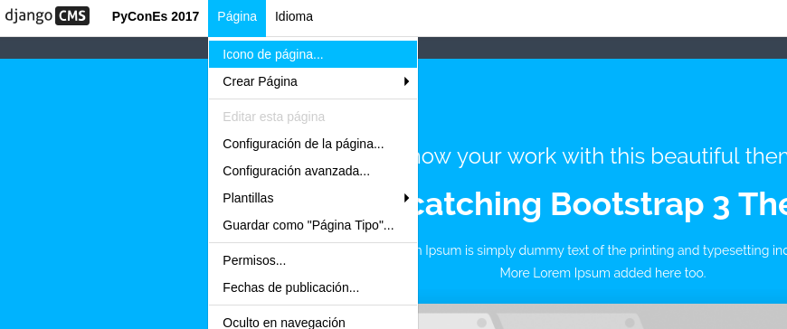
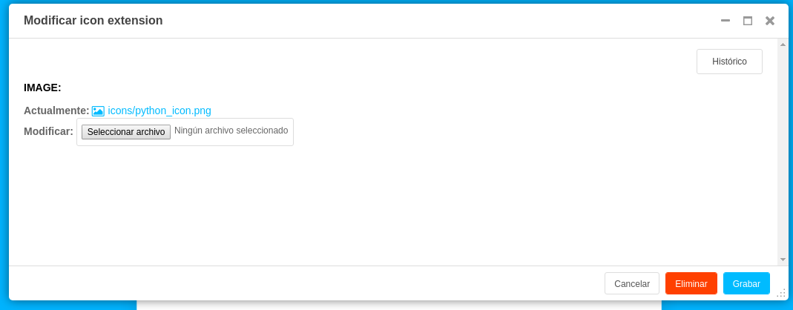

# Extender el modelo de Página

Podemos ampliar los modelos `cms.models.Page` y `cms.models.Title`  con sus propios campos (por ejemplo añadiendo un icono para cada página) usando los modelos de extensión: `cms.extensions.PageExtension` y `cms.extensions.TitleExtension` respectivamente.

# Title vs Page extensions

La diferencia entre una extensión de página y una extensión de título está relacionada con la diferencia entre los modelos `cms.models.Page` y `cms.models.Title models`.

## Page

Añadir campos que deberían tener los mismos valores para las diferentes versiones lingüísticas de una página (por ejemplo, un icono).


## Title

Añadir campos que deben tener valores específicos de idioma para las diferentes versiones lingüísticas de una página (por ejemplo, palabras clave).

## Implementar una extensión básica

Tres pasos básicos:

1. Añadir el modelo de extensión
2. Añadir la extensión admin
3. Añadir un elemento de menú de la barra de herramientas para la extensión

## Extensión del modelo Página

Ejemplo sencillo que añade un campo de icono a la página

```
from django.db import models
from cms.extensions import PageExtension
from cms.extensions.extension_pool import extension_pool


class IconExtension(PageExtension):
    image = models.ImageField(upload_to='icons')


extension_pool.register(IconExtension)
```

El siguiente paso es crear y aplicar las migración para este nuevo modelo que hemos creado.

`python manage.py makemigrations`

`python manage.py migrate`


Para la extensión sea editable, primero debe crear una clase de admin que herede de ` cms.extensions.PageExtensionAdmin` dentro del fichero `admin.py` de nuestra app my_web_cms

```
from django.contrib import admin
from cms.extensions import PageExtensionAdmin

from .models import IconExtension


class IconExtensionAdmin(PageExtensionAdmin):
    pass

admin.site.register(IconExtension, IconExtensionAdmin)
```

**PageExtensionAdmin** hereda de **ModelAdmin**, por lo que podremos utilizar el conjunto normal de propiedades de ModelAdmin de Django.

Hay que tener en cuenta que el campo que contiene la relación entre la extensión y la página CMS no es editable, por lo que no aparece directamente en las vistas de administrador de página. En la documentación oficial esto puede ser tratado en una actualización futura, pero mientras tanto la barra de herramientas proporciona acceso a ella.


Para añadir a la barra de herramientas el elemento para nuestra extensión, crearemos un archivo llamado `cms_toolbars.py` en nuestra app my_web_cms y añadiremos un nodo al menú de Página existente, llamado Icono de Página. Cuando se selecciona, se abrirá un diálogo modal en el que se podrá editar el campo Icono de página.

Añadimos una imagen a nuestra página HOME:





### DEMO

Vamos a usar nuestra extensión de página.

Añadimos en nuestro `base.html` (justo debajo de ``) el siguiente trozo de código

```
  
    
  
```

Podemos observar que nuestra home muestar la imagen que hemos añadido, sin embargo si entramos la página "sobre nosotros" no se muestra imagen alguna. Podemos añadir una imagen distinta a esta página y volver a comprobar.


## Extensión del modelo Title

[documentación oficial](http://docs.django-cms.org/en/release-3.4.x/how_to/extending_page_title.html#title-extensions).

Para recuperar una extensión de title dentro de una plantilla, tenemos que coger el objeto title utilizando `request.current_page.get_title_obj`. Podemos usar el ejemplo anterior:

`{{ request.current_page.get_title_obj.ratingextension.rating }}`

## Manejo de las relaciones

>Si PageExtension o TitleExtension tiene una ForeignKey o un ManyToManyField, hay que sobreescribir el método `copy_relations(self, oldinstance, language)` para que estos campos se copien apropiadamente cuando el CMS haga una copia de su extensión para soportar versionado (borrador y publicado), etc.

Ejemplo que usa un ManyToManyField:

```
from django.db import models
from cms.extensions import PageExtension
from cms.extensions.extension_pool import extension_pool


class MyPageExtension(PageExtension):

    page_categories = models.ManyToManyField(Category, blank=True)

    def copy_relations(self, oldinstance, language):
        for page_category in oldinstance.page_categories.all():
            page_category.pk = None
            page_category.mypageextension = self
            page_category.save()

extension_pool.register(MyPageExtension)
```
