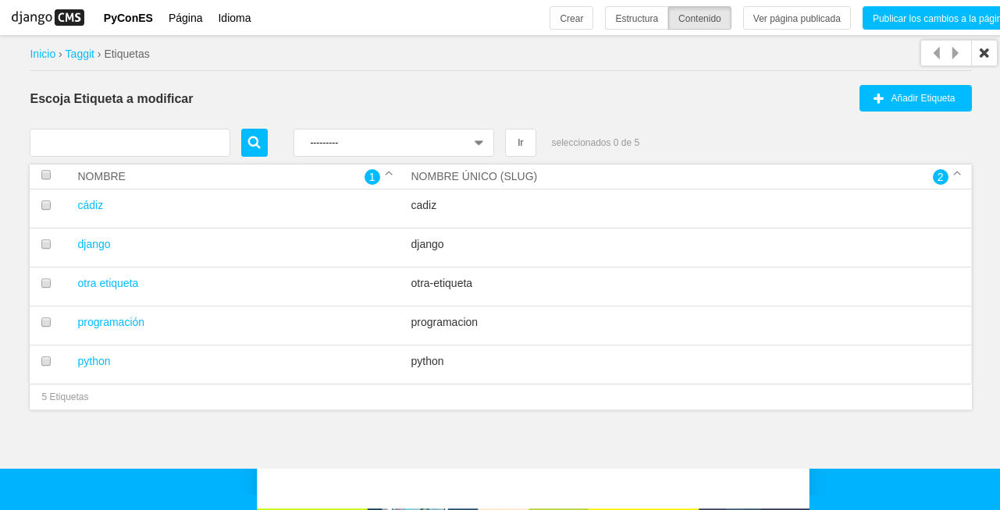

# Extender el Toolbar

Django CMS permite agregar y quitar elementos de la barra de herramientas (toolbar).

Esto le permite integrar el modo de edición de frontend de django CMS en su aplicación django y proporcionar a sus usuarios una experiencia de edición optimizada.

Para ejemplificar esta característica de django CMS vamos a integrar en el toolbar dos nuevos elementos, una aplicación de terceros ya preparada para integrarla desde el settings.py y otra que no:

Nuestro toolbar tiene el siguiente aspecto actualmente:


## Extender toolbar desde settings.py

[Django filer ](https://github.com/divio/django-filer) es una aplicación de gestión de archivos e imágenes para django que ya viene preparada para integrar un punto de entrada en el toolbar con sólo añadir un settings.

* Abrimos `settings.py` y en `INSTALLED_APPS` añadimos justo debajo de 'filer' la siguiente linea:

`'filer.contrib.django_cms',`

Ahora nuestro toolbar tendrá un nuevo punto de menú el siguiente aspecto actualmente:


## Extender toolbar en una aplicación no preparada

Vamos a integrar en el toolbar la aplicación [Django Taggit ](https://github.com/alex/django-taggit). Django taggit es como su nombre indica una aplicación de django para gestionar las etiquetas. Un inconveniente que trae es que no trae consigo la integración con django CMS por lo que para incluirla en el toolbar del mismo tendremos que currar un poco más :)

Para ello tenemos que añadir el siguiente código al fichero `cms_toolbars.py` que creamos antes para añadir al toolbar nuestra extensión de página:

```
from cms.toolbar_base import CMSToolbar
from django.core.urlresolvers import reverse
from cms.toolbar.items import Break, SubMenu
from cms.cms_toolbars import ADMIN_MENU_IDENTIFIER, ADMINISTRATION_BREAK

@toolbar_pool.register
class TaggitToolbar(CMSToolbar):

    def populate(self):
        #
        # 'Apps' is the spot on the existing djang-cms toolbar admin_menu
        # 'where we'll insert all of our applications' menus.
        #
        admin_menu = self.toolbar.get_or_create_menu(
            ADMIN_MENU_IDENTIFIER, _('PyConES')
        )

        #
        # Let's check to see where we would insert an 'Offices' menu in the
        # admin_menu.
        #
        position = admin_menu.get_alphabetical_insert_position(
            _('Tags'),
            SubMenu
        )

        #
        # If zero was returned, then we know we're the first of our
        # applications' menus to be inserted into the admin_menu, so, here
        # we'll compute that we need to go after the first
        # ADMINISTRATION_BREAK and, we'll insert our own break after our
        # section.
        #
        if not position:
            # OK, use the ADMINISTRATION_BREAK location + 1
            position = admin_menu.find_first(
                Break,
                identifier=ADMINISTRATION_BREAK
            ) + 1
            # Insert our own menu-break, at this new position. We'll insert
            # all subsequent menus before this, so it will ultimately come
            # after all of our applications' menus.
            admin_menu.add_break('custom-break', position=position)

        # OK, create our taggit menu here.
        taggit_menu = admin_menu.get_or_create_menu(
            'taggit-menu',
            _('Tags ...'),
            position=position
        )

        # Let's add some sub-menus to our tag menu that help our users

        # Take the user to the admin-listing for tags...
        url = reverse('admin:taggit_tag_changelist')
        taggit_menu.add_sideframe_item(_('Tag List'), url=url)

        # Display a modal dialogue for creating a new tag...
        url = reverse('admin:taggit_tag_add')
        taggit_menu.add_modal_item(_('Add New Tag'), url=url)

        # Add a break in the sub-menus
        taggit_menu.add_break()

```

Ahora nuestro toolbar tendrá un nuevo punto de menú el siguiente aspecto actualmente:





