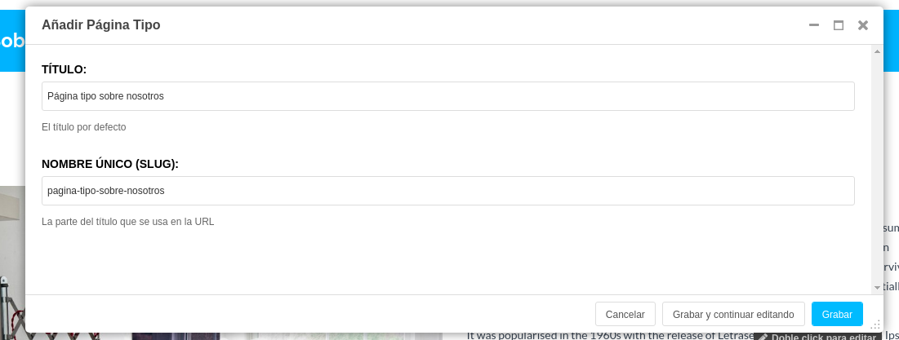
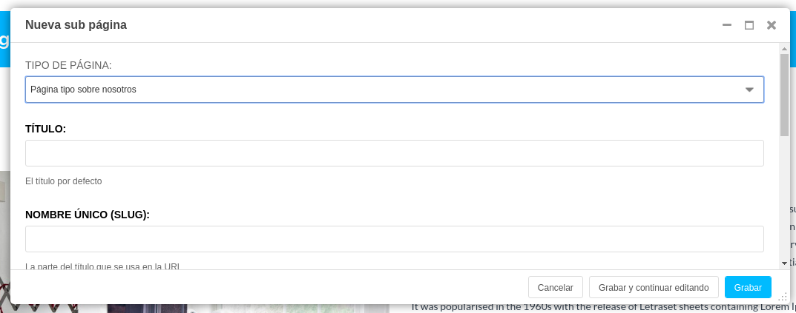

# Páginas tipo

Las página tipo facilitan a los editores de contenido la creación de páginas a partir de otras páginas ya definidas.

Las "páginas tipo" tienen contenido como plugins que se copiarán a la página recién creada.

* Primero crearemos una nueva página de la forma habitual; esto se convertirá en la plantilla para tu nueva página tipo.

* Utilizaremos esta página como nuestra plantilla para agregar contenido de ejemplo y plugins hasta dejarla como queramos.

* Cuando lo tengamos como queremos, seleccionaremos __Guardar como tipo de página...__ en el __menú Página__ y le daremos un nombre que nos permita distinguirla en el futuro.

* Podemos seguir cambiando su contenido y configuración en el futuro.

* Ya tendremos una nueva página tipo que tendremos disponible desde __Agregar página__ y el cuadro de diálogo __Crear__.

