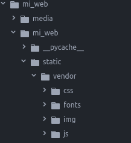

# Templates & Placeholders

Veamos ahora los Placeholders y las plantillas.

## Plantillas

Con las plantillas podemos personalizar el aspecto de nuestro sitio web, definir placeholders para marcar secciones de contenido gestionado y utilizar etiquetas especiales para generar menús y mucho más.

Podemos definir varias plantillas, con diferentes estilos, layouts, componentes y elegirlas para cada página según sea necesario. Una plantilla de página se puede cambiar por otra en cualquier momento.

La plantilla de la página de inicio creada automáticamente es fullwidth.html, la primera que aparece en la configuración del settings.py ***CMS_TEMPLATES***:

~~~
CMS_TEMPLATES = (
    ## Customize this
    ('fullwidth.html', 'Fullwidth'),
    ('sidebar_left.html', 'Sidebar Left'),
    ('sidebar_right.html', 'Sidebar Right')
)
~~~

Podemos ver que tenemos una plantilla html que se llama ***base.html*** la cual contiene la estructura básica que heredará todas las plantillas y además crearemos una nueva que llamaremos ***home.html*** que será la que configuraremos para la home de nuestra web.

Antes de modificar nuestras plantillas vamos a trasladar los assets del tema SOLID a nuestro proyecto, para ello copiamos el directorio `assets` dentro del directorio `static` y le cambiamos el nombre de assets a `vendor` que será el que nosotros utilicemos.

### base.html

Los cambios que añadimos a nuestra home para adaptarla son:

* Añadimos el templatetag static

``

* Creamos un block justo antes del `` para incluir dentro los ficheros con los estilos del tema SOLID con los que crearemos nuestra web.

~~~

  <!-- Bootstrap core CSS -->
  <link href="" rel="stylesheet">
  <!-- Custom styles for this template -->
  <link href="" rel="stylesheet">
  <link href="" rel="stylesheet">



~~~

* Quitamos el div con la clase __container__ y dejamos sólamente el menú y el block content.

~~~
<ul class="nav">
    
</ul>

~~~

* Al igual que con las css creamos otro block justo antes del `` para incluir dentro los ficheros con los ficheros javascript.

~~~

  
  
  
  
  
  
  
  


~~~

A continuación creamos nuestra plantilla ***home.html***

~~~






	

~~~

## Placeholders

Los placeholders o marcadores de posición son una forma fácil de definir secciones en una plantilla HTML que se rellenará con contenido de la base de datos cuando la página sea renderizada.

Este contenido se edita usando django CMS, usando los template tags de Django.

Nuestra home.html contiene un único placeholder por el momento

``

Primero hemos cargado el template tag cms_tags para poder usar los tags __placeholder__ y __page_attribute__

``

## Static Placeholders

El contenido de los placeholders que hemos visto hasta ahora es diferente para cada página. A veces, queremos tener una sección en nuestra web que debe ser la misma en todas las página, como el bloque de pie de página.

Podríamos programar el pie de página en el html directamente, pero sería mejor ser capaz de controlarlo a través del CMS. Para esto son los __placeholders estáticos__.

Los placeholders estáticos son una forma fácil de mostrar el mismo contenido en múltiples sitios en nuestra web. Actúan casi como los placeholders normales, excepto por el hecho de que una vez que se crea y se agrega contenido a él, se guardará globalmente. Incluso cuando elimine los placeholders estáticos de una plantilla, puede reutilizarlos más tarde.

Crearemos el footer de nuestra web con un static placeholder:

~~~
<footer>
  
</footer>
~~~

Después de editar el footer nuestra vista estructura de la home tiene que verse de un manera similar a la siguiente:

Podemos ver que el placeholder de Footer tiene una chincheta que nos indica que es estático, dicho placeholder estará en todas las templates.

# Resultado final de plantillas base y home

Nuestra plantilla `base.html` tiene que quedar de la siguiente manera:

~~~

<!doctype html>
<html>
    <head>
      <meta charset="utf-8">
      <meta http-equiv="X-UA-Compatible" content="IE=edge">
      <meta name="viewport" content="width=device-width, initial-scale=1">
      <meta name="description" content="">
      <meta name="author" content="">
      <link rel="shortcut icon" href="">

      <title>This is my new project home page</title>

      

      
        <!-- Bootstrap core CSS -->
        <link href="" rel="stylesheet">

        <!-- Custom styles for this template -->
        <link href="" rel="stylesheet">
        <link href="" rel="stylesheet">
      

      
      

    </head>
    <body>
        
        <ul class="nav">
            
        </ul>

        

        <footer>
          
        </footer>
        
          
          
          
          
          
          
          
          
        
        
    </body>
</html>

~~~

Crearemos también una plantilla `home.html` que será con la que montemos la página home de nuestra web, el resultado sería como sigue:

~~~






	


~~~

También tendremos que añadirla al `CMS_TEMPLATES` del `settings.py`:

~~~
CMS_TEMPLATES = (
    ## Customize this
    ('fullwidth.html', 'Fullwidth'),
    ('sidebar_left.html', 'Sidebar Left'),
    ('sidebar_right.html', 'Sidebar Right'),
    ('home.html', 'Home')
)
~~~

## DEMO

Ahora es tiempo de editar la página y crear nuestra home replicando la del tema SOLID.
